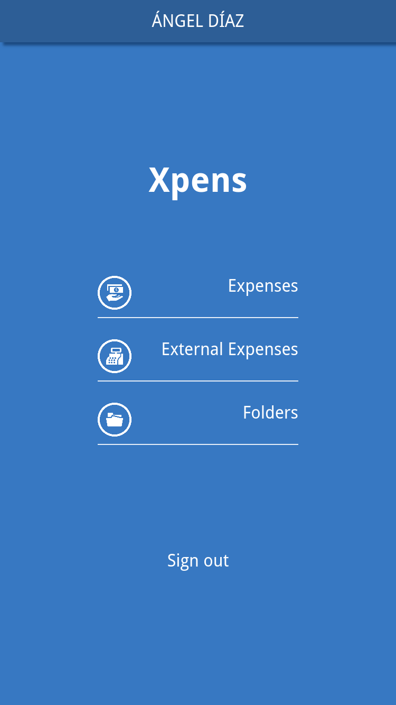
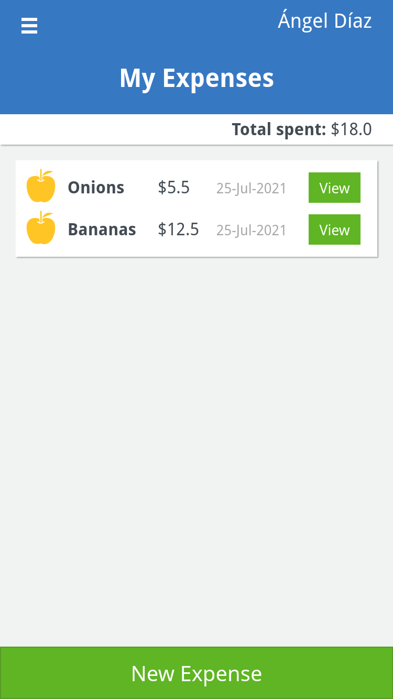
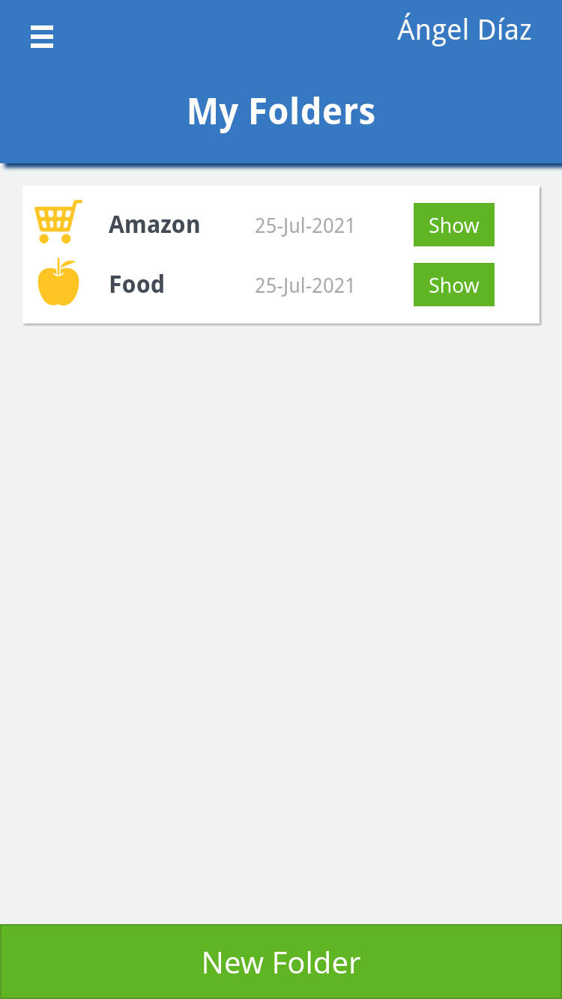

# Xpens - Ruby on Rails Capstone Project

Xpens is a web application that allows you to save all your expenses and categorize them into folders.</br>
Xpens is an educational project for Microverse using Ruby on Rails.

## Built With

- ?style=plastic&logo=ruby>)
- ?style=plastic&logo=postgresql>)

### Prerequisites

- This web app uses ruby 3.0.1. Make sure you are using the correct version. `rvm use 3.0.1`</br>
Then check your currently ruby version with `ruby --version`</br>
- PostgreSQL should be installed previously. Make sure that it is install by entering the following command on the terminal `postgres --version`</br>
If no version is provided you will need to install it. [Get PostgreSQL](https://www.postgresql.org/download/).</br>
- Javascript package manager [npm](https://docs.npmjs.com/getting-started). Again, make sure it is installed. Run `npm --version`

## Getting Started

To get started, first, clone this project by using the following command:

```
git clone https://github.com/ad9311/xpens.git
```

Then change directory into the root folder `cd xpens`</br>
Before launching the application, you will need to run a few commands:</br>

```
bundle install
```

After this, it is required to create a new database and then set it up:

```
rails db:create
rails db:setup
```
**Note:** This app uses a seed (seeds.rb) file so it is important to run `rails db:setup` instead of `rails db:migate`</br>
Failing to do so will have the app not work correctly.</br>

This command will correctly set up the database.</br>

Lastly, run `npm install` necessary for Rspec

Now access the project with `rails s` to launch the server and then follow the link http://127.0.0.1:3000 to open it in the browser.</br>

Since no user is registered when launching the app for the first time, you must click sign up and create a new account.</br>
After login, the user can access three main links.</br>





Expenses shows link all expenses that are part of at least one folder.</br>
External Expenses link shows all expenses that are not part of any folder.</br>
And finally Folders link show all the folders created by the currently logged-in user. Opening a folder will show you all of its expenses.</br>

Expenses can be part of multiple folders.

## Live Version

There is a live version available in [xpens-app](https://xpens-app.herokuapp.com/)

### Contributing

Contributions, issues and feature requests are welcome!

You can do it on [issues page](https://github.com/ad9311/xpens/issues).

## Show your support

Give a ⭐️ if you like this project!

## Acknowledgments

- Special thanks and credits to [Gregoire Vella](https://www.behance.net/gregoirevella) for inspiring this project. Check out his project [Snapscan](https://www.behance.net/gallery/19759151/Snapscan-iOs-design-and-branding?tracking_source=)
- [Microverse](https://www.microverse.org/) for international opportunities.
- Special thanks to all code reviewers.

## Authors

**Ángel Díaz**

- GitHub: [@ad9311](https://github.com/ad9311)
- Twitter: [@adiaz9311](https://twitter.com/adiaz9311)
- LinkedIn: [Ángel Díaz](https://www.linkedin.com/in/ad9311/)

## Show your support

Give a ⭐️ if you like this project!

## 📝 License

This project is [MIT](./LICENSE) licensed.
